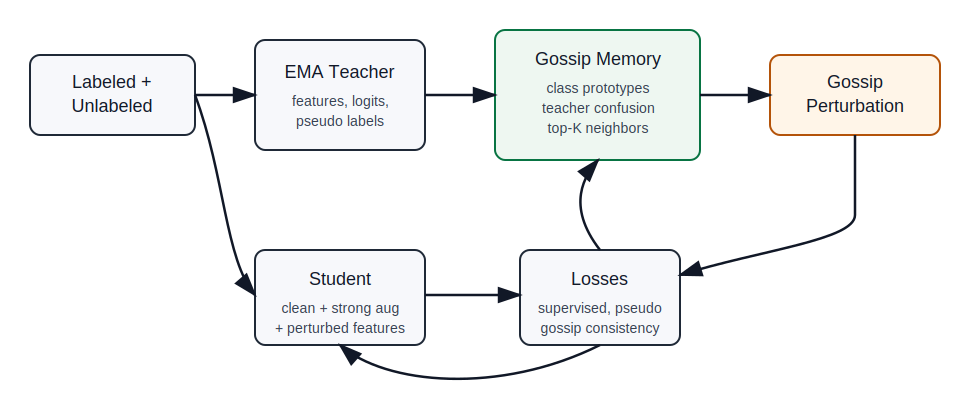

# GossipFP: Gossip-Guided Feature Perturbation for Semi-Supervised Semantic Segmentation

GossipFP is a semi-supervised semantic segmentation project derived from the DDFP training framework, but the original density-estimation innovation is replaced by a class-level gossip strategy.

The key idea is not to apply gossip as a generic optimizer. Full-parameter gossip is expensive for segmentation and weakly connected to pixel-level errors. GossipFP instead treats each semantic class as a gossip node. Each node maintains an online feature prototype, listens to nearby or confusing classes, and uses the exchanged information to generate boundary-aware feature perturbations for unlabeled pixels.



## Why GossipFP

Density-descending perturbation needs an extra normalizing flow model to estimate high-dimensional feature density online. That makes training heavier and the perturbation direction can be statistically meaningful without being semantically targeted. In semi-supervised segmentation, the harder failure mode is usually pseudo-label bias near class boundaries and underrepresented classes. GossipFP addresses this by using class prototypes and teacher confusion to perturb features toward the most relevant semantic neighbors, then enforcing consistency under that perturbation.

## Method Modules

- `model/gossip/memory.py`: class prototype gossip memory with distributed updates.
- `model/model/attack.py`: gossip-guided adversarial feature perturbation.
- `model/model/decoder.py`: injects gossip perturbations in the DeepLabV3+ decoder.
- `train_gossip_pascal.py` and `train_gossip_city.py`: update the gossip memory from teacher features and train the student with gossip consistency.
- `paper/gossipfp_cvpr_draft.tex`: CVPR-style paper draft for the new method.

## Installation

```bash
conda create -n gossipfp python=3.10
conda activate gossipfp
pip install -r requirements.txt
```

Download the ResNet-101 pretrained weight and place it at the project root if you use the original checkpoint-loading path:

```text
GossipFP/
  resnet101.pth
```

## Data Layout

Pascal VOC:

```text
/workspace/data/Pascal/VOCdevkit/VOC2012/
  JPEGImages/
  SegmentationClass/
```

Cityscapes:

```text
/workspace/data/Cityscapes/
  leftImg8bit/
  gtFine/
```

Adjust `data_root` in the experiment config if your AutoDL mount path differs.

## Training

Pascal VOC 732 labels:

```bash
cd exp/pascal/732/exp
bash train.sh 4 29500
```

Pascal VOC 1464 labels:

```bash
cd exp/pascal/1464/exp
bash train.sh 4 29500
```

Cityscapes 372 labels:

```bash
cd exp/city/372/exp
bash train.sh 4 29500
```

For one GPU, use `bash train.sh 1 29500`. On AutoDL, set `CUDA_VISIBLE_DEVICES` before launching if you do not want the default `0,1,2,3`.

## Important Config Fields

```yaml
trainer:
  sup_only_epoch: 1
  gossip_start_epoch: 1
  thresh: 0.95

gossip:
  topk: 3
  momentum: 0.99
  confusion_weight: 0.5
  loss_weight: 0.05
```

`topk` controls how many neighbor classes each class gossips with. `confusion_weight` controls how strongly teacher confusion affects neighbor selection. `loss_weight` controls the auxiliary clean-feature separation loss; the main gain should still come from gossip-guided perturbation consistency.

## Suggested Ablations

- Baseline: teacher-student consistency without gossip perturbation.
- Gossip perturbation only: `gossip.loss_weight: 0.0`.
- Gossip perturbation plus separation: default config.
- Neighbor source: prototype similarity only vs. prototype similarity plus teacher confusion.
- `topk`: 1, 3, 5.

## Notes

The original density estimator and FrEIA dependency have been removed from the training path. Checkpoints now save the online class memory as `gossip_state`.
